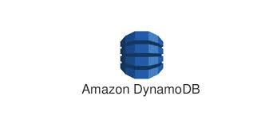
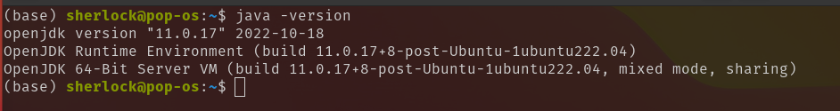
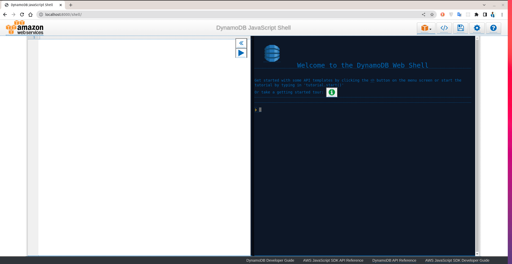

<p align="center">
  
</p>

# AWS DynamoDB

## Installation:

Step by step installation procedure to AWS DynamoDB on local machine

### Step 1: Install JDK on local machine

- _Linux_ and _WSL_ :
  Open the terminal and run the following commands

```bash
sudo apt update
sudo apt install default-jre
java -version
```

This last command will give you a output like this:


Go through [Install JDK on Linux](https://www.digitalocean.com/community/tutorials/how-to-install-java-with-apt-on-ubuntu-22-04) for proper installation instructions.

### Step 2: Download DynamoDB

[Click to Download DynamoDB](https://s3.ap-south-1.amazonaws.com/dynamodb-local-mumbai/dynamodb_local_2021-04-27.tar.gz)

### Step 3: Setting Up DynamoDB

- Extract the tar.gz file in your prefered directory/location

In my case, the file structure looks like the following

```
dynamodb_local_2021-04-27
    ├── DynamoDBLocal.jar
    ├── DynamoDBLocal_lib
    ├── LICENSE.txt
    ├── README.txt
    ├── shared-local-instance.db
    └── THIRD-PARTY-LICENSES.txt
```

Now go to `dynamodb_local_2021-04-27` directory and run the following command in your `terminal`:

### Step 4: Running DynamoDB

```bash
java -Djava.library.path=./DynamoDBLocal_lib -jar DynamoDBLocal.jar -sharedDb
```

Note: Make sure you are in right directory where the `DynamoDBLocal.jar` is located

After running the above command you should see a output like this in your terminal

```
Initializing DynamoDB Local with the following configuration:
Port:	8000
InMemory:	false
DbPath:	null
SharedDb:	true
shouldDelayTransientStatuses:	false
CorsParams:	*
```

After that browse [this link]('http://localhost:8000/shell/') to access DynamoDB shell or go to `http://localhost:8000/shell/`



## CRUD Opeartion

Here are some resources that I found useful

- [AWS Docs](https://github.com/awsdocs/aws-doc-sdk-examples/tree/main/javascript/example_code/dynamodb) (Must Read)
- [Video tutorial](https://www.youtube.com/watch?v=vU82HIt88Fw) (See this video just to get started)
- Click `</>` icon on the dynamodb shell and you will see the syntax of various operations
